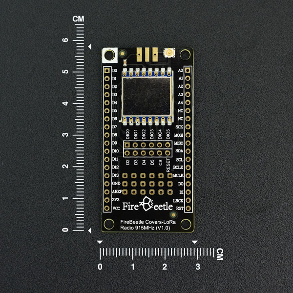

# DFRobot_LoRa
- [English Version](./README.md)

DFRobot FireBeetle萤火虫系列是专为物联网设计的低功耗微控制器。此款FireBeetle LoRa 915MHz无线传输模块，采用高性能SX127x LoRa 915MHz芯片，内置PA增益，在空旷可视范围内可达5KM，实测城市距离大于1KM。支持FSK调制方式，支持最大传输速率300Kbps，支持LoRaTM，最大传输速率37.5Kbps。支持Arduino，支持低功耗，在睡眠模式下电流小于0.2uA。可以应用在远程抄表、家庭自动化检测、轮胎气压监测、健康监测、可穿戴等系统。




## 产品链接(https://www.dfrobot.com.cn/goods-1540.html)

    SKU：TEL0122

## 目录

* [概述](#概述)
* [库安装](#库安装)
* [方法](#方法)
* [兼容性](#兼容性)
* [历史](#历史)
* [创作者](#创作者)
 
## 概述
该库用于发送和接收远程无线电数据。

## 库安装

这里提供两种使用本库的方法：
1. 打开Arduino IDE,在状态栏中的Tools--->Manager Libraries 搜索"DFRobot_LoRa"并安装本库.
2. 首先下载库文件,将其粘贴到\Arduino\libraries目录中,然后打开examples文件夹并在该文件夹中运行演示.


## 方法

```C++
  /**
   * @fn init
   * @brief 初始化 lora模块
   * @param NSSPin     输出引脚，从属选择引脚
   * @param NRESETPin  输出引脚，低驱动时进入关机模式
   * @return  返回true代表成功，false 代表失败
   */
  bool init(uint8_t NSSPin = NSS_PIN, uint8_t NRESETPin = RESET_PIN);
  
  /**
   * @fn rxInit
   * @brief 初始化接收模式
   * @return  返回true代表成功，false 代表失败
   */
  bool rxInit();
  
  /**
   * @fn sendPackage
   * @brief 通过射频发送数据包
   * @param sendbuf  需要发送的数据
   * @param	sendLen  要发送的数据长度，不超过64字节
   * @return  返回true代表成功，false 代表失败
   */
  bool sendPackage(uint8_t* sendbuf,uint8_t sendLen);
  
  /**
   * @fn receivePackage
   * @brief 接收射频报文
   * @param recvbuf  存接受数据的缓存区
   * @return 接收数据的长度
   */
  uint8_t receivePackage(uint8_t* recvbuf);
  
  /**
   * @fn waitIrq
   * @brief 查询中断。
   * @param irqMask  中断标志
   * @return  返回true代表有中断，false 代表没中断
   */
  bool waitIrq(uint8_t irqMask = LR_RXDONE_MASK);

  /**
   * @fn idle
   * @brief 进入待机模式。
   */
  void idle();

  /**
   * @fn sleep
   * @brief 进入睡眠模式。
   */
  void sleep();

  /**
   * @fn clearIRQFlags
   * @brief 清中断标志指令
   */
  void clearIRQFlags();
  
  /**
   * @fn setFrequency
   * @brief 设置射频频率。
   * @param	freq  频率
   * @return  返回true代表成功，false 代表失败
   * @note   范围是137~1020Mhz lora1276,137~525Mhz lora1278
  */
  bool setFrequency(uint32_t freq);
  
  /**
   * @fn setRFpara
   * @brief 射频参数设置。
   * @param BW  带宽，范围从7.8k到500k
   * @param CR  编码率:4/5 ~ 4/8
   * @param SF  扩散因子，范围为6 ~ 12
   * @param CRC  校验
   * @n       LR_PAYLOAD_CRC_ON:带CRC校验,
   * @n       LR_PAYLOAD_CRC_OFF:不带CRC校验
   * @return  返回true代表成功，false 代表失败
   * @note 射频数据速率依赖于带宽，而传播因子编码速率则影响广播时间。如果SF=6，它将在这个函数中转为隐式模式
   */
  bool setRFpara(uint8_t BW,uint8_t CR,uint8_t SF,uint8_t CRC);
  
  /**
   * @fn setPreambleLen
   * @brief  设置 Preamble 长度
   * @param len 长度
   * @return  返回true代表成功，false 代表失败
   */
  bool setPreambleLen(uint16_t length);

  /**
   * @fn setHeaderMode
   * @brief 设置包头模式
   * @param	mode LR_IMPLICIT_HEADER_MODE or LR_EXPLICIT_HEADER_MODE
   * @note	if SF=6 ,it must be implicit header mode
   */
  bool setHeaderMode(uint8_t mode);
  
  /**
   * @fn readRSSI
   * @brief 读取 rssi
   * @param  mode 0：读取当前rssi, 1：读取接收到的最后一个包的rssi
   * @return  rssi
   */
  uint8_t readRSSI(uint8_t mode = 0);

  /**
   * @fn setTxPower
   * @brief 设置发射功率
   * @param power  功率等级，0到15
   * @return  返回true代表成功，false 代表失败
   */
  bool setTxPower(uint8_t power);

  /**
   * @fn setPayloadLength
   * @brief 设置负载长度
   * @param	len 负载长度
   * @note 在隐式报头模式下，必须先设置有效载荷长度。length在隐式报头模式下是固定的
   */
  bool setPayloadLength(uint8_t len);
```

## 兼容性

MCU                | Work Well | Work Wrong | Untested  | Remarks
------------------ | :----------: | :----------: | :---------: | -----
FireBeetle-ESP32   |      √       |             |            | 
FireBeetle-ESP8266 |      √       |             |            | 
FireBeetle-328P    |      √       |             |            | 


## 历史

- 2021/11/01 1.0.3 版本.
- 2021/11/01 1.0.2 版本.
- 2021/10/18 1.0.1 版本.
- 2017/08/30 1.0.0 版本.

## 创作者

Written by yangfeng(feng.yang@dfrobot.com), 2021. (Welcome to our [website](https://www.dfrobot.com/))
